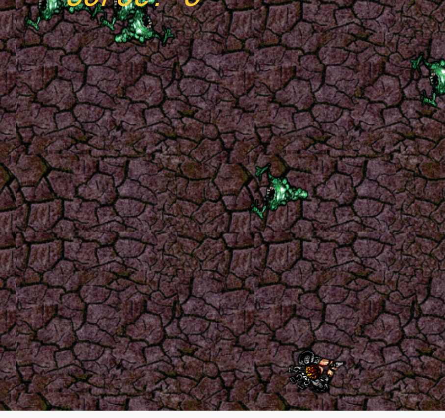
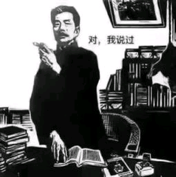

# 我的第一个biubiu游戏
* 制作软件 [Construct 2](https://www.scirra.com/construct2)
* [引用教程](https://www.scirra.com/tutorials/37/beginners-guide-to-construct-2?page=2)
## 使用感悟
记得当时看着室友们在旁边制作这游戏时，像个沙雕一样沉迷，时不时的痴痴地傻笑，叫着他一起来打LO也不来，马蛋说好的双排上分呢。

（╯' - ')╯︵ ┻━┻ 我简直不能理解，就这2D游戏有啥好玩的，我十三就是从这里跳下去也不会为了这个不打LO。

然而，第二天，的我。

这图里的是我完全是跟着教程制作来的（毕竟我菜），但是当自己不断的去翻译（教程是英文的呜呜呜呜呜）教程，跟着它搭建好每一步，克服每一个疑惑，看着这个游戏慢慢的完善起来，会为每一次新添的元素试玩而感到新奇高兴。这虽然不能完整意义的算得上去创作，但这是每一个初学者的第一步，我们是从前人的作品里去学习再逐步建立起自己的风格。

**只有不断去实践才能做出来好的东西，而不是好高骛远的想一下子去搞出什么惊天动地的大事**
  >鲁迅

**如果你把一个画家的作品按照时间顺序排列，就会发现每幅画所用的技巧，都是建立在上一幅作品里学到的东西之上。某幅作品如果有特别出色之处，你往往能在更早的作品里面发现一个小规模的初期版本**
  >《黑客与画家》

~~**书也叫我玩，对吧**~~

是这游戏先动的手呜呜呜呜，我超爱学习的，呜呜呜，诶，你贴的那个子弹好帅能把图发给我吗。（滑稽

好了言归正传，接下来是干货
***
* 首先我们要打开网站（最顶上我已经贴好了超链接啦，**两个都要打开！！！！**
* 然后你就可以开始看教程啦
* 没了

就没了？对就没了

**年轻人要学会自学**

**真的猛士敢于直面~~惨淡~~（划掉）幸福的教程**

>鲁迅
* 我是为了你好，你自己去学习才能记得更牢固，还能学习到更多的新单词，对吧多好。不不不不，我没有想去玩游戏!
* 你胡说，我要去学习!(认真脸.jpg)

* 加油哦年轻人，嘻嘻嘻嘻嘻

什么？你说为什么是祝你平安，我不知道诶。我就是，就是，就是想这样说啊。一看到你，我脑海里就不自觉的蹦出了这句话，就想这样轻轻地轻轻地对你把它讲出来。
嘻嘻，也没多少英文单词，就几页吧233333333333333333
