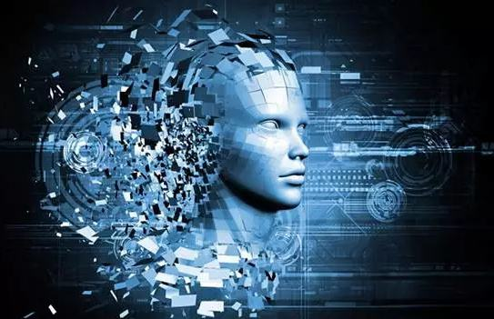
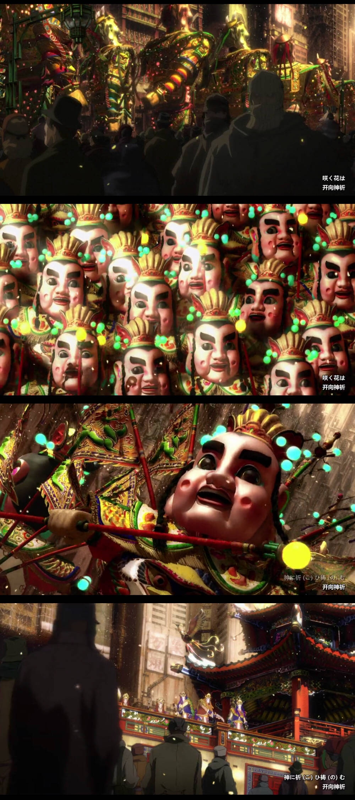

# 人工智能与人

* 自从人工智能被提出来以来，对它的争议就没停过，有人看好它，有人觉得它未来会反过来摆脱人类的束缚从而毁灭人类。尚未定论，我觉得其实它未来的走向是由人们的选择而决定的。
* 在这里我不做过多的讨论，但我想让人们一直保持警醒，对于人工智能的使用，下面我们来看一部经典的电影《攻壳机动队》。
## 攻壳机动队
* 这是我最爱的关于AI的电影，没有之一。
* 它以悬疑的手法来展示整个事件，在主角调查深入的同时，将案件不断地揭露。在整个故事中，我们看到的并不是苍白的机器人罪案，而是作为作者想象的整个未来世界的社会现象，人类生存在半数字化的时代，传统人文与科技的碰撞，这些这个电影都有展示出来。
*我偏爱下面这个画面*

* 很惊艳对不对，这是主角们去一个住宅查找线索时抵达的城市，满满的传统文化风搭配上朋克的建筑，加上配乐《傀儡谣》简直无敌了，你就仿佛亲身置于那个光怪陆离的世界里。你觉得他们都是活生生的，我也不知道这里作者想传达的是什么，但我确确实为之着迷，那些活生生的人，他们生活在那里，他们拥有着自己独特的混杂传统文化，他们言语，他们静伫，他们欢笑，他们悲伤，这究竟是怎样一个奇幻的世界，我迫不及待的想要去了解，恨不得自己化身数据而被写入到这个世界里。
* 起初我也认为这是一个讲机器人拥有自己思想叛变人类的故事，后来才知道，确实是机器人拥有了自己的思想，但这是人为的，是老板为了自己的利益将小孩的思想复制抽取注入机器人的芯片里，这样得到的机器人具有更高的主观能动性，因此更受到人们的欢迎，从而获取更多的利益。
* 可悲的是故事是以机器人杀人开始的，但这仅仅是那些小孩为了自救做出的吸引外界注意力的举动，作者在最后将这个矛盾点给抛了出来，引人深思。
**有时候人们做的事情是否仅仅是对自己有益的呢**？就像历史遗留性的环境问题，就像军火贩子在世界上不断挑起的争端，就像战争，就像我们即将对人工智能做的事情。
* 有人会说人工智能就是用来服务人类的啊，但是当未来某一天，这项技术已经发展到足以附加给机器思想的地步呢？我们又将怎么去看待他们，像奴隶一样圈养？
### 电影里的技术
* 人体半数字化（义体）

电子脑

这时候的人们身体坏掉的部分完全可以用电子设备去替代，而且硬盘和网络与人脑的链接已经实现，即使人们不去看某些书也能直接在脑海里索引，作者也在故事中展现了他的恶趣味，角色有时候会引用一些经典语录，但不得不说它们都很切题，当然这也是作者有深厚的文学功底。我是真的羡慕这样的技术，想想我们可以避开多少无意义的背诵就能去记住他们，简直是理科生的福利啊有木有。
 
这里面作者也指出了这个技术的漏洞。主角被黑入电子眼，大脑感知的画面和真实的画面并不完全相同，这里就直接差点被自己干掉。后来主角和搭档去往那个别墅时，也中了病毒，陷进了无线的轮回里面，差点出不来。这里也说明了人脑对记忆的清楚是不彻底的，当模拟不断重复时，破绽就越来越大，人脑再去捕捉这个漏洞就能脱离出来。数据清除的重要性！

#### 电子化
* 电影里的人类是电子化而不是信息化，是指人类躯体的被替换，而不是像黑客帝国里的那样，人类思维被接入一个信息世界里。这两者的区别就在这，一个是真实的，一个是虚幻的，但其实很多时候，真实和虚幻怎么去证明呢。就像电影里素子对自己的拷问，我是真的存在吗。素子作为一个仅有大脑是人类的结合体，代表着从有逐渐走向虚无，她的身体已经不是自己的了，所以她在战斗的时候一点也不爱惜，直到自己被整个替换为了小女孩的躯体。而大反派傀儡王作为一个人工智能，在网络的不断侵入中察觉到了自己的存在，代表着从无到有。后来他想和素子结合，实现人类生命系统的新生命诞生模式，这不得不说是讽刺。